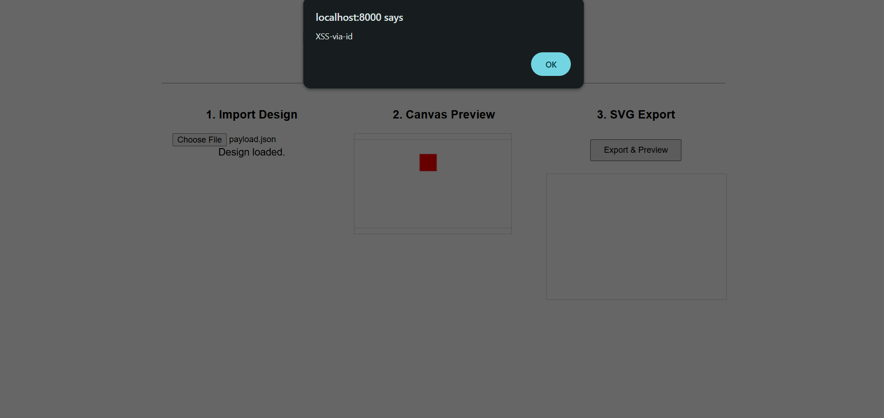

fabric.js applies `escapeXml()` to text content during SVG export (`src/shapes/Text/TextSVGExportMixin.ts:186`) but fails to apply it to other user-controlled string values that are interpolated into SVG attribute markup. When attacker-controlled JSON is loaded via `loadFromJSON()` and later exported via `toSVG()`, the unescaped values break out of XML attributes and inject arbitrary SVG elements including event handlers.

### Deserialization Path 

`loadFromJSON()` (`src/canvas/StaticCanvas.ts:1229`) calls `enlivenObjects()` which calls `_fromObject()` (`src/shapes/Object/Object.ts:1902`). `_fromObject` passes all deserialized properties to the shape constructor via `new this(enlivedObjectOptions)`. The constructor ultimately calls `_setOptions()` (`src/CommonMethods.ts:9`) which iterates over every property and assigns it to the object via `this.set(prop, options[prop])`. There is no allowlist or sanitization - any property in the JSON, including `id`, is set verbatim on the fabric object.

---

### Finding 1: XSS via `id` Property Injection 

The `id` property from deserialized JSON is interpolated directly into SVG attribute strings without escaping.

**Vulnerable code (`src/shapes/Object/FabricObjectSVGExportMixin.ts`, line 89, `getSvgCommons()`):**
```typescript
getSvgCommons(
  this: FabricObjectSVGExportMixin & FabricObject & { id?: string },
) {
  return [
    this.id ? `id="${this.id}" ` : '',  // <-- unescaped, user-controlled
    this.clipPath
      ? `clip-path="url(#${...})" `
      : '',
  ].join('');
}
```

This method is called in `_createBaseSVGMarkup()` (same file, line 178) which wraps every object's SVG output in a `<g>` element. Every fabric object type (Rect, Circle, Path, Text, Image, Group, etc.) inherits this mixin, so the `id` injection vector applies to all object types.

**Contrast with text content, which IS escaped:**
```typescript
// src/shapes/Text/TextSVGExportMixin.ts:186
return `<tspan ...>${escapeXml(char)}</tspan>`;
```

The inconsistency shows that the intention was to prevent injection but was missed w attribute contexts.

---

### Finding 2: XSS via Image `src` / `xlink:href` Injection 

Image source URLs are interpolated raw into `xlink:href` in `_toSVG()`.

**Vulnerable code (`src/shapes/Image.ts`, line 404, `_toSVG()`):**
```typescript
imageMarkup.push(
  '\t<image ',
  'COMMON_PARTS',
  `xlink:href="${this.getSvgSrc(true)}" x="${x - this.cropX}" y="${
    y - this.cropY
  }" ...`  // <-- unescaped
);
```

`getSvgSrc()` returns the image `src` property which is set from JSON during deserialization. An attacker can inject a `src` value that breaks out of the `xlink:href` attribute.

---

### Finding 3: XSS via Pattern `sourceToString()` 

**Vulnerable code (`src/Pattern/Pattern.ts`, line 181, `toSVG()`):**
```typescript
`<image x="0" y="0" ... xlink:href="${this.sourceToString()}"></image>`
// <-- unescaped, returns this.source.src for image sources
```

Additionally, Pattern's constructor (`line 92–94`) runs `this.id = uid()` *before* `Object.assign(this, options)`, meaning a user-supplied `id` in the pattern JSON overwrites the auto-generated uid. The pattern `id` is then interpolated unescaped on line 180:
```typescript
`<pattern id="SVGID_${id}" x="${patternOffsetX}" ...>`
```

---

### Finding 4: Gradient `id` Partial Injection (lower Severity)

**Vulnerable code (`src/gradient/Gradient.ts`, line 212, `toSVG()`):**
```typescript
`id="SVGID_${this.id}"`  // <-- unescaped
```

Gradient's constructor (`line 125`) computes ``id: id ? `${id}_${uid()}` : uid()``. If a user-supplied `id` is present in the gradient JSON, it is prepended to the auto-generated uid. The user-controlled portion is interpolated unescaped into the SVG. This is exploitable but the payload is constrained by the `_<uid>` suffix appended after it.

---

## Proof of Concept


The poc simulates a realistic collaborative design tool ("DesignShare") where users can import shared canvas designs as JSON and preview them as SVG - a common pattern in web-based editors built on fabric.js.


### Steps to Reproduce




1. Build fabric.js (`npm run build`) or ensure `fabric.js/dist/index.min.js` exists.
2. Open the provided `poc.html` in a browser (note: it may need to be served via a local web server to access local files or use the file picker).
3. Use the file picker in the PoC to load the provided `payload.json` file.
4. Click "Export & Preview".
5. `alert('XSS-via-id')` fires immediately.

The injected `"` in the `id` value closes the attribute prematurely. The `"><set onbegin="..."` payload breaks out of the `<g>` tag's `id` attribute and injects an SVG `<set>` element whose `onbegin` handler executes JavaScript when the SVG is parsed by the browser.

---

## Impact

Any application that:
1. Accepts user-supplied JSON (via `loadFromJSON()`, collaborative sharing, import features, CMS plugins), AND
2. Renders the `toSVG()` output in a browser context (SVG preview, export download rendered in-page, email template, embed)

...is vulnerable to stored XSS. An attacker can execute arbitrary JavaScript in the victim's browser session.

Real-world attack scenarios:
- Collaborative design tools (Canva-like apps) where users share canvas state as JSON
- CMS or e-commerce platforms with fabric.js-based editors that store/render designs
- Any export-to-SVG workflow where the SVG is later displayed in a browser
- 
---

## Remediation

Update to version >=7.2.0 of fabric.js

---

## Confirmed Affected Files

| File | Issue | Method | Exploitable |
|---|---|---|---|
| `src/shapes/Object/FabricObjectSVGExportMixin.ts` | Unescaped `this.id` in attribute | `getSvgCommons()` | Yes - primary vector, all object types |
| `src/shapes/Image.ts` | Unescaped `getSvgSrc()` in `xlink:href` | `_toSVG()` | Yes |
| `src/Pattern/Pattern.ts` | Unescaped `sourceToString()` in `xlink:href`; unescaped `id` in attribute | `toSVG()` | Yes |
| `src/gradient/Gradient.ts` | User-supplied `id` prefix interpolated unescaped | `toSVG()` | Yes (partial - uid suffix appended) |